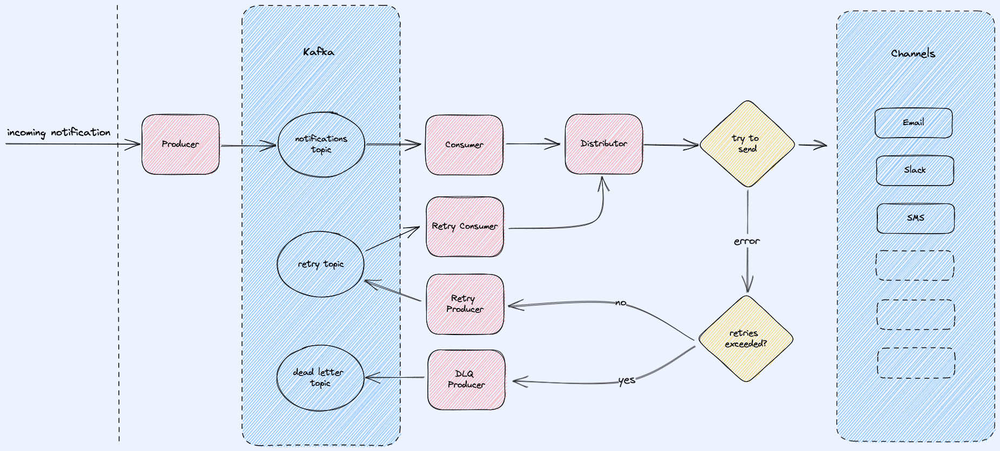

# notification-system

#### Requirements
Create a notification sending system:
- The system needs to be able to send notifications via several different channels (email, sms, slack) and be easily extensible to support more channels in the future.
- The system needs to be horizontally scalable.
- The system must guarantee an "at least once" SLA for sending the message.
- The interface for accepting notifications to be sent can be chosen on your own discretion.

#### Overview
The system supports sending notifications through different channels. A single notification can be sent to a single channel. It has a http handler for accepting notifications. It uses _kafka_ for processing them.
- **API**
```
POST /notifications

Content-Type: application/json
{
	"channel": "slack",
	"message": "message"
}
```
#### Notification flow
Kafka message value structure:
```json
{
	"channel": "email",
	"message": "email message"
	"retry_count": 0
}
```

On failure the notification is sent to a _retry-topic_, depending on `max_retries` from the config. When `max_retries` has been exceeded the system sends the notification to a _dead-letter-topic_ where it can be investigated and handled manually.


#### Config
The system expects a yaml config file, the path can be specified by running it with a flag `--config path/to/config.yaml`, by default it looks for a *config.yaml* in the root directory. See `./config_example.yaml`. Desired channels can be specified in the config.
#### Channels
The system supports adding new channels.
##### SMS
[Twilio](https://www.twilio.com/blog/send-sms-30-seconds-golang)
##### Slack
1. Create a new Slack App
2. Give your bot/app the following OAuth permission scopes: `chat:write`, `chat:write.public`
3. Copy your _Bot User OAuth Access Token_ and desired _Channel ID_ and add them to the config
##### Email 
The email channel uses smtp.
##### Log
Channel that can be used for testing purposes. It writes the received messages to `os.Stdout`.
#### Run
Requires `Docker`  `docker-compose`
##### App
1. Create a `config.yaml` by copying `config_example.yaml`
```bash
cp config_example.yaml config.yaml
```
2. Fill in desired channel config, by default only the _Log_ channel is enabled.
3. Run 
```bash
docker-compose up --build
```
4. You can now use the API to send a notification
```bash
curl --request POST \
  --url http://localhost:8090/notifications \
  --header 'Content-Type: application/json' \
  --data '{
	"channel": "log",
	"message": "Some message."
}'
```
If you send via channel _log_ (and it is enabled), you will be able to see the message inside the `docker-compose` log
```bash
app_1        | received message: Some message.
```
#### Test 
1. Create a `/test/config.yaml` by copying `/test/config_example.yaml`
```bash
cp test/config_example.yaml test/config.yaml
```
2. Run the app as described above.
3. Run
```bash
docker compose exec app go test ./... -v
```

